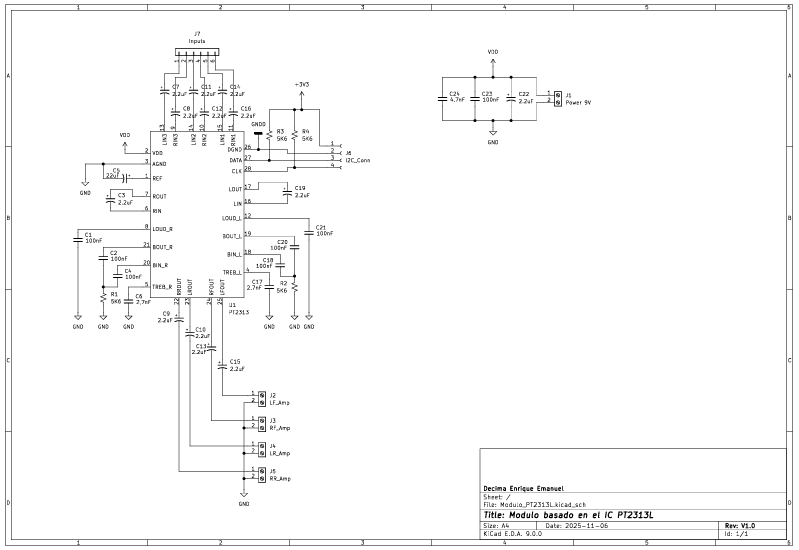
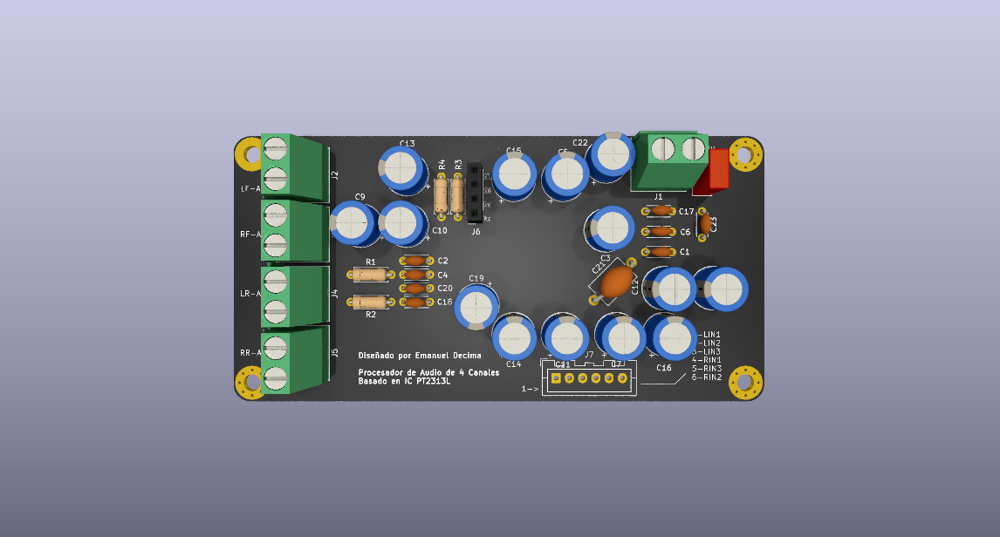

# Módulo de Procesamiento de Audio PT2313L
Módulo estéreo de control de volumen, tono, balance y loudness basado en el integrado PT2313L. Diseñado para aplicaciones de audio Hi-Fi y sistemas de sonido personalizados.

## 🔧 Características
- Control digital de volumen, tono, balance y loudness mediante bus I²C.
- Entradas de audio estéreo con selección de canal.
- Alimentación simple de 9–12 V DC.
- Pines de control compatibles con microcontroladores (Arduino, STM32, ESP32, etc.).
- PCB de simple faz, tamaño compacto (100 mm × 50 mm).
- Boneras para alimentación y salidas de audio
- Conector JST para entradas de audio
- Conector de 4 pines para comunicación mediante bus I²C.

## 🖼️ Esquema y PCB

## ⚙️ Documentación técnica
El módulo está basado en el integrado **PT2313L**, un procesador de audio con control digital I²C.  
Las señales de audio ingresan a través de conectores JST y pasan por la etapa de selección y control del PT2313L antes de salir hacia el amplificador.  
Los niveles de volumen, balance y tono son programables por software.

## 🧰 Requisitos
- Controlador I²C (Arduino, STM32, ESP32, Raspberry Pi, etc.)
- Fuente de alimentación regulada 9–12 V DC
- Señal de audio de nivel de línea

## 🧠 Compatibilidad
Probado con:
- Arduino Nano / UNO
- STM32F103C8 ("Blue Pill")
- ESP32-WROOM

## 👤 Autor
Diseñado por Emanuel Décima  
📧 Contacto: emanueldecima3@gmail.com  
📅 Noviembre 2025
